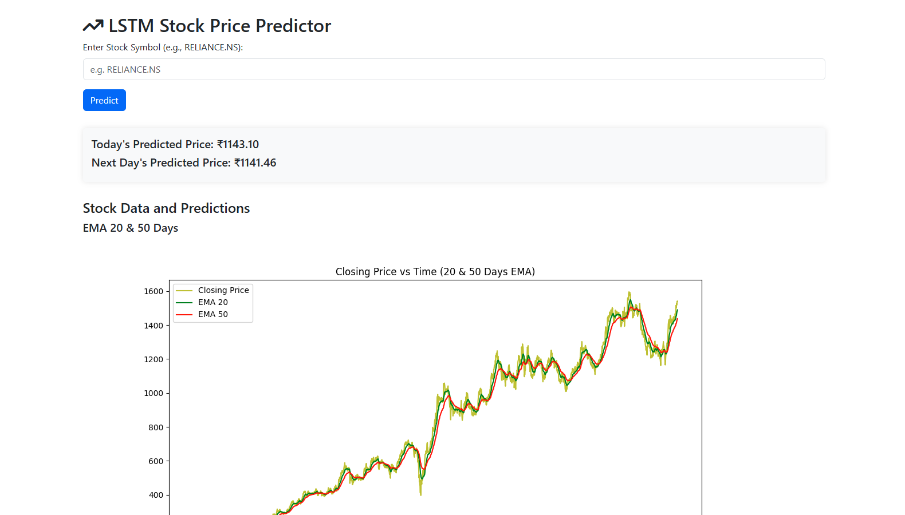
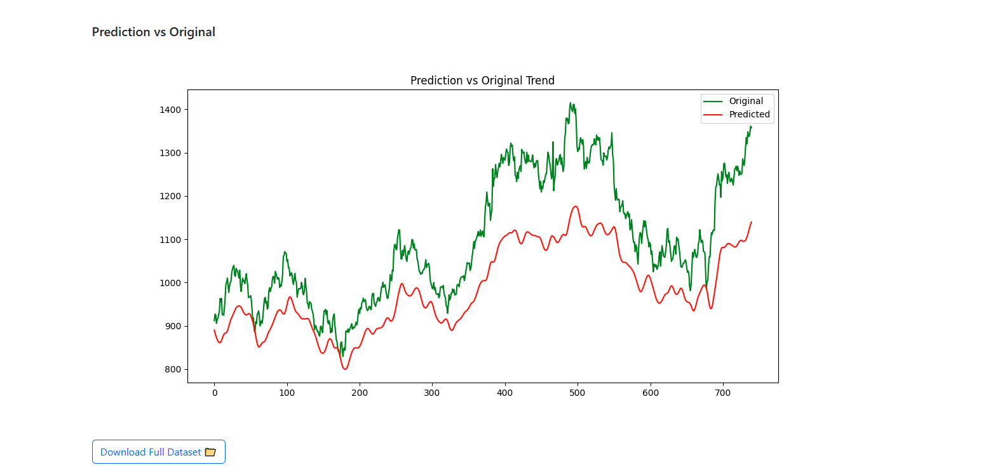

#  LSTM Stock Price Predictor

A Django-based web application that uses deep learning (LSTM) to forecast stock prices. Enter a stock ticker (e.g., `RELIANCE.NS`) and get predictive insights for today and tomorrow, complete with interactive charts and downloadable data.


---

## 🚀 Features

- Predict **today's** and **next day's** stock price using a trained LSTM model
- Fetch 10 years of historical data using [Yahoo Finance](https://finance.yahoo.com/)
- Visualizations:
  - 📊 Exponential Moving Averages (20, 50, 100, 200 days)
  - 📈 Prediction vs Actual comparison
- Download full processed stock dataset as CSV
- Responsive UI powered by Bootstrap 5

---

## 🧠 Technologies Used

| Category       | Stack                          |
| -------------- | ------------------------------ |
| Backend        | Django, Python, Keras, Scikit-learn |
| Deep Learning  | LSTM model using Keras/TensorFlow |
| Data Source    | Yahoo Finance (`yfinance` API) |
| Frontend       | HTML, Bootstrap 5, Font Awesome |
| Plotting       | Matplotlib                     |
| Miscellaneous  | Joblib, NumPy, Pandas, SQLite  |

---

## 🗂️ Project Structure

```bash
├── core/                     # Core app with views and ML logic
├── stockpredictor/          # Django project settings
├── static/                  # Static files and plots
├── templates/               # HTML templates
├── Screenshots/             # (Optional) UI preview images
├── db.sqlite3               # Default database
├── manage.py                # Django entry point
├── .gitignore
└── README.md
```

## 🖥️ How to Run Locally
| Clone the Repo
```bash
git clone https://github.com/Rohit-Kushwaha-483/stockpredictor.git
cd stockpredictor
```

| Start the Server
```bash
python manage.py runserver
```
Then open your browser and navigate to http://127.0.0.1:8000.


## 📸 Screenshots




## 🧪 Sample Tickers

- RELIANCE.NS
- TCS.NS
- INFY.NS
- AAPL (Apple Inc.)
- MSFT (Microsoft)
| Note: Use .NS suffix for Indian stocks from NSE.

---

### ⚠️ Disclaimer

<div style="border: 1px solid #f5c6cb; background-color: #f8d7da; padding: 15px; border-radius: 5px; color: #721c24; font-family: Arial, sans-serif;">
  <strong>This application is intended for educational and research purposes only.</strong><br><br>
  Predictions provided by this tool are based on historical stock data and a machine learning model.<br>
  They are <strong>not guaranteed to be accurate</strong> and <strong>should not be used</strong> for real-world trading or investment decisions.<br>
  <strong>Please do not rely</strong> on this application for financial gains — always consult a certified financial advisor before making investment choices.
</div>